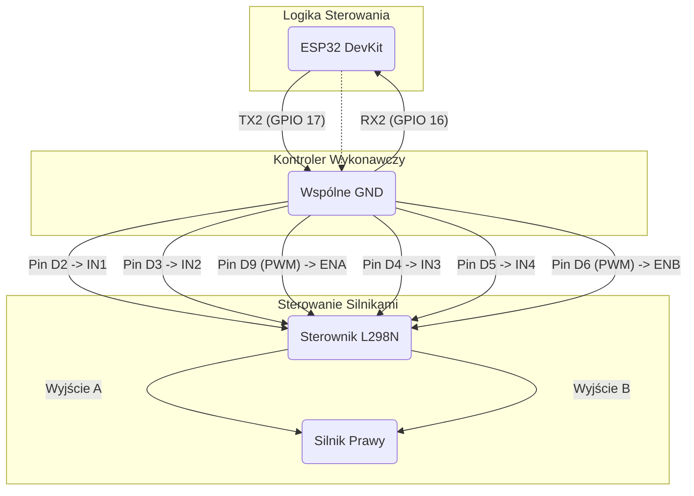

# Projekt robota BB-8 (Architektura rozdzielona: ESP32 + Arduino)

Ten projekt to zmodernizowana implementacja robota BB-8, która wykorzystuje architekturę dwumodułową dla większej wydajności i elastyczności. Logika sieciowa jest oddzielona od sterowania silnikami w czasie rzeczywistym.

- **Oryginalna instrukcja budowy:** [DIY BB8 - Fully 3D Printed (Instructables.com)](https://www.instructables.com/id/DIY-BB8-Fully-3D-Printed-20cm-Diameter-First-Proto/)

---

## Architektura Rozdzielona (Dual MCU)

System został podzielony na dwa współpracujące ze sobą mikrokontrolery, co jest powszechną praktyką w zaawansowanej robotyce.

### 1. ESP32 - "Mózg" (Kontroler Wi-Fi)
- **Rola:** Zarządzanie logiką wysokiego poziomu.
- **Zadania:**
  - Tworzy punkt dostępowy (Access Point) Wi-Fi.
  - Uruchamia serwer WWW z API do sterowania.
  - Przyjmuje polecenia od użytkownika (przez przeglądarkę).
  - Tłumaczy polecenia (np. `/move/forward`) na proste, jednoliterowe komendy (np. `F`) i wysyła je do Arduino przez port szeregowy.
- **Plik z kodem:** `src/BB8_WiFi_Controller.ino`

### 2. Arduino Nano - "Mięśnie" (Kontroler Silników)
- **Rola:** Zarządzanie logiką niskiego poziomu w czasie rzeczywistym.
- **Zadania:**
  - Nasłuchuje na porcie szeregowym na komendy od ESP32.
  - Po otrzymaniu komendy (np. `F`) wykonuje odpowiednią funkcję sterującą silnikami (np. `ileri()`).
  - Precyzyjnie kontroluje prędkość i kierunek silników za pomocą sygnałów PWM.
- **Plik z kodem:** `src/BB8_Motor_Controller.ino`

## Schemat Połączeń (ESP32 <-> Arduino)

Aby moduły mogły się komunikować, połącz je w następujący sposób:

- **`ESP32 TX2 (GPIO 17)`**  ->  **`Arduino Nano RX (Pin D0)`**
- **`ESP32 RX2 (GPIO 16)`**  ->  **`Arduino Nano TX (Pin D1)`**
- **`ESP32 GND`**           ->  **`Arduino Nano GND`** (Wspólna masa jest **niezbędna** do poprawnej komunikacji!)




## Struktura projektu

```
.
├── src/
│   ├── BB8_WiFi_Controller.ino   # Kod dla ESP32 ("Mózg")
│   └── BB8_Motor_Controller.ino  # Kod dla Arduino ("Mięśnie")
└── README.md
```

## Wymagania

### Moduł 1: ESP32
- **Sprzęt:** Płytka ESP32 DevKitC (lub podobna).
- **Oprogramowanie:**
  - Arduino IDE z obsługą płytek ESP32.
  - Biblioteki: `ESPAsyncWebServer`, `AsyncTCP`.

### Moduł 2: Arduino Nano
- **Sprzęt:**
  - Arduino Nano.
  - Sterownik silników L298N i reszta elektroniki z oryginalnego projektu.
- **Oprogramowanie:** Arduino IDE (bez dodatkowych bibliotek).

## Jak zacząć?

1.  **Montaż:** Złóż mechanikę i elektronikę zgodnie z oryginalną instrukcją. Połącz ESP32 z Arduino Nano według powyższego schematu.

2.  **Wgranie kodu na Arduino:**
    - Podłącz **tylko Arduino Nano** do komputera.
    - W Arduino IDE otwórz plik `src/BB8_Motor_Controller.ino`.
    - Wybierz płytkę "Arduino Nano", odpowiedni procesor i port COM, a następnie wgraj kod.

3.  **Wgranie kodu na ESP32:**
    - Odłącz Arduino i podłącz **tylko ESP32** do komputera.
    - W Arduino IDE otwórz plik `src/BB8_WiFi_Controller.ino`.
    - Wybierz swoją płytkę ESP32 i jej port COM, a następnie wgraj kod.

4.  **Uruchomienie i sterowanie:**
    - Zasil cały układ (obie płytki).
    - Na komputerze lub smartfonie połącz się z siecią Wi-Fi **`BB8-Control`** (hasło: **`12345678`**).
    - Otwórz przeglądarkę i steruj robotem, wpisując w pasku adresu polecenia (np. `http://192.168.4.1/move/forward`). Pełna lista poleceń znajduje się w `README` poprzedniej wersji.
